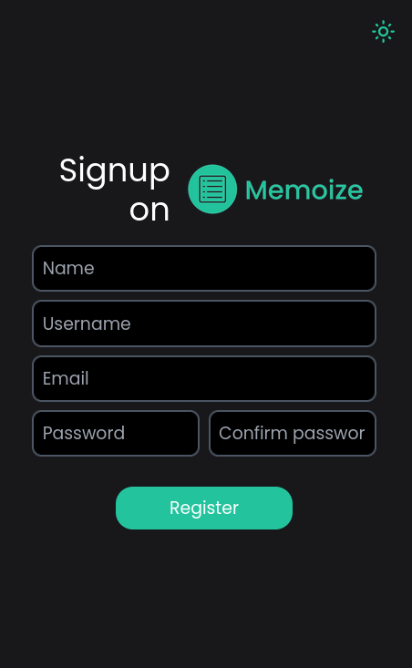
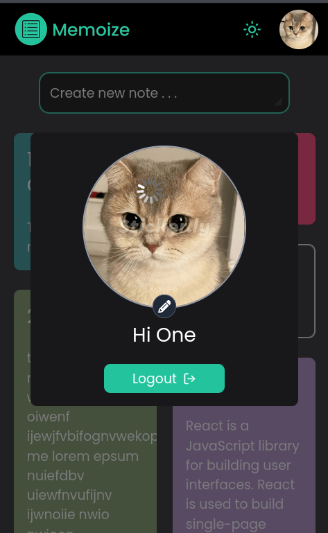

# Memoize (Version 1.0)
Memoize is a simple and intuitive notes app designed to help you organize your thoughts, ideas, and tasks effortlessly. With its clean and minimalist interface, Memoize makes it easy to jot down notes and stay organized, whether you're at work, school, or on the go.

# Getting Started
This app is deploved on <b>Vercel</b>. 
To get started with Memoize, simply hop onto : [https://memoize-notes.vercel.app/](https://memoize-notes.vercel.app/)

# Screenshots
### Big Screens: 

### Small screens:

# Features in current version
- User-friendly Interface: Enjoy a clean and intuitive interface that makes taking notes a breeze.
- Responsive design: Adjusts according to your screen for best user experience.
- Dark and Light modes.
- Cloud Sync: Seamlessly sync your notes across multiple devices for access anytime, anywhere.
- Customization: Personalize your notes with different colors to suit your preferences.
- Add/update profile picture.
- Secure Authentication: Keep your notes safe and secure with built-in encryption using bCrypt and JWT.

# Tech Stack
This project is a full-stack web application built on <b>MERN stack</b>, with  <b>React.js</b> for the front end, <b>Express.js</b> for the Server/API, and <b>MongoDB</b> as the database. The application provides a robust framework for creating dynamic and interactive user interfaces while handling data storage and retrieval efficiently.

### Libraries used: 
- #### <b>Frontend:</b> React JS, React-Router, Redux-Toolkit, Tailwind CSS, Framer Motion  
  (React JS for building entire frontend, React-Router for frontend page routing, Redux-Toolkit for state management, Tailwind CSS for designing UI, Framer Motion for smooth-animated page transitions)
- #### <b>Server:</b> Express JS, Mongoose, Axios, bCrypt, JWT  
    (Express JS for building server and defining API endpoints, Mongoose for defining MongoDB collection and schema, Axios for sending requests to respective endpoints and retrieving response, bCrypt for hashing passwords and note's text, JWT for user authentication)
- #### <b>Backend:</b> MongoDB as Database
